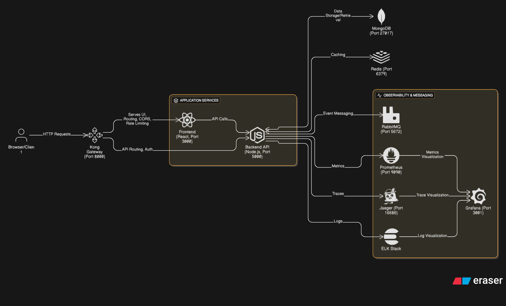

# LYBOOK Project Structure



## Directory Structure

```
LYBOOK/
├── backend/                 # Node.js/Express API
│   ├── models/             # MongoDB models
│   ├── routes/             # API routes
│   ├── logs/               # Application logs
│   ├── server.js           # Main server file
│   └── package.json        # Dependencies
├── frontend/               # React application
│   ├── src/                # Source code
│   ├── public/             # Static files
│   └── package.json        # Dependencies
├── monitoring/             # Observability stack
│   ├── grafana/            # Dashboard configs
│   ├── logstash/           # Log processing
│   └── prometheus.yml      # Metrics config
├── api-gateway/            # Kong configuration
├── README-IMAGES/          # Documentation images
│   └── structure_diagram.png
├── docker-compose.fixed.yml # Container orchestration
└── .env.enhanced           # Environment variables
```

## Architecture Components

### Core Application
- **Frontend**: React.js user interface
- **Backend**: Node.js/Express REST API  
- **Database**: MongoDB with authentication

### Observability Stack
- **Prometheus**: Metrics collection
- **Grafana**: Visualization dashboards
- **Jaeger**: Distributed tracing
- **ELK Stack**: Centralized logging

### Infrastructure
- **Redis**: Caching layer
- **RabbitMQ**: Message broker
- **Kong**: API Gateway
- **Docker**: Containerization

